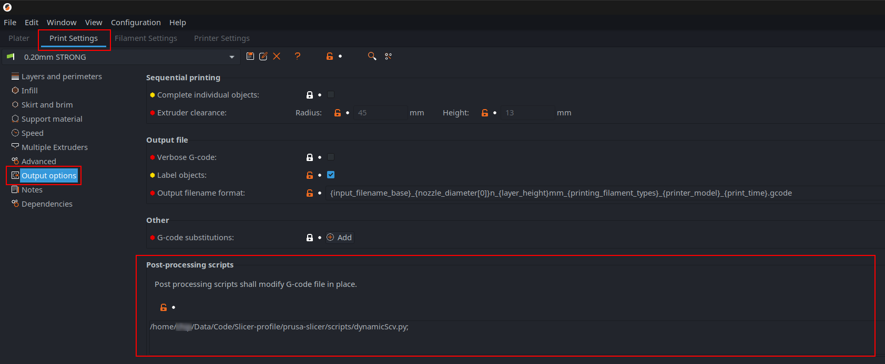
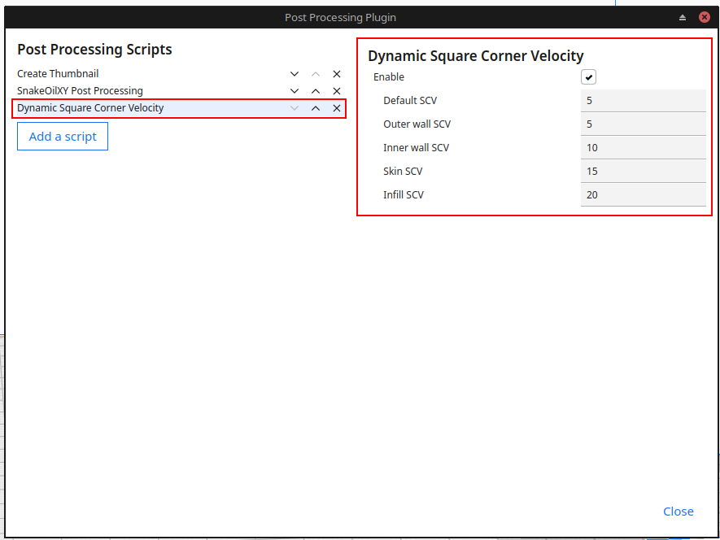

# Klipper Dynamic Square Corner Velocity

Inspired by [RomRider](https://github.com/RomRider)'s [klipper-FastGyroidInfill](https://github.com/RomRider/klipper-FastGyroidInfill/blob/main/superslicer/FastGyroidInfill.py). 

- This slicer post-processing script allow you set custom Square Corner Velocity(CSV) not just of infill but also other print moves(outer perimeter/wall, inner perimeter/wall, infill, overhang, top/bottom fill, support).
- Support Cura, Prusa slicer, super slicer.
- Does not require any custom macro config.

## Installation (for PrusaSlicer and SuperSlicer)

- Copy <code>dynamicScv.py</code> and <code>dynamicScv.cfg</code> into a folder on your computer. Make sure there is no space in the file path.
- Open your slicer > <code>Print setting</code> > <code>Output options</code> > <code>Post-processing scripts</code> ans enter the full file path of the <code>dynamicScv.py</code> script.
- Edit <code>dynamicScv.cfg</code> and enter the suitable SCV for your machine.
- ※Linux user might need to edit the <code>#!/usr/bin/python3</code> header of <code>dynamicScv.py</code> file to match their system.

## Installation (for Cura)
- Copy <code>DynamicScv.py</code> into your cura <code>scripts</code> folder. (The location of the folder can be checked in Cura menu <code>Help</code> > <code>Show configuration folder</code>. You might need to create <code>scripts</code> if it does not exist.)
- Restart Cura 
- In cura menu <code>Extensions</code> > <code>Post processing</code> -> <code>Modify G-Code</code> and select <code>Dynamic Square Corner Velocity</code>
- Enter the suitable SCV value for your machine in the right config section.

