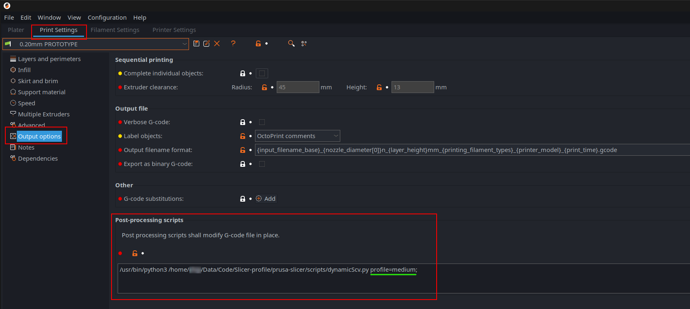
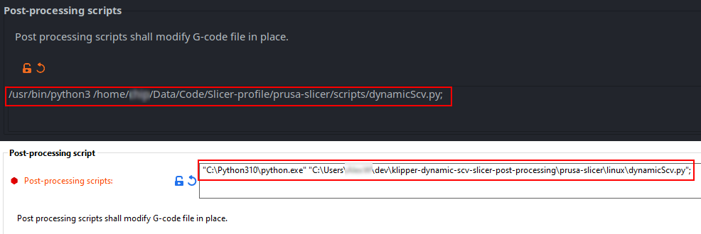
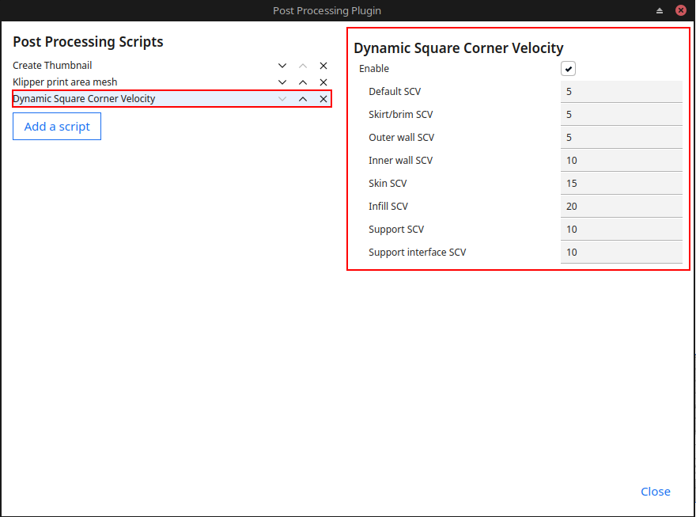

# Klipper Dynamic Square Corner Velocity

Inspired by [RomRider](https://github.com/RomRider)'s [klipper-FastGyroidInfill](https://github.com/RomRider/klipper-FastGyroidInfill/blob/main/superslicer/FastGyroidInfill.py). 

- This slicer post-processing script allow you set custom Square Corner Velocity(CSV) not just of infill but also other print moves(outer perimeter/wall, inner perimeter/wall, infill, overhang, top/bottom fill, bridge and support).
- Support Cura, Prusa slicer, super slicer.
- Does not require any custom macro config.
- Custom version for <code>dynamic jerk</code> also available. (Tested on RRF)  

## Installation (for PrusaSlicer and SuperSlicer)

- Copy <code>dynamicScv.py</code> and <code>dynamicScv.cfg</code> into a folder on your computer. Make sure there is no space in the file path.
- Open your slicer > <code>Print setting</code> > <code>Output options</code> > <code>Post-processing scripts</code> ans enter the full file path of the <code>dynamicScv.py</code> script.
- Edit <code>dynamicScv.cfg</code> and enter the suitable SCV for your machine.*Depend on the system config, user might need to set which Python interpreter to use for the post-processing script.  
- The script will load the <code>[default_profile]</code> of the config file by default. To load other profile, add <code> profile=PROFILE_NAME</code> after the script path.  

  

Prusa slicer config. (Linux, defaultPython = python3)
  

  

Prusa slicer config with profile name. (Linux, defaultPython = python3)
  

  

Prusa slicer config. (Linux and Windows with specified python3 binary)
   

## Installation (for Cura)
- Copy <code>DynamicScv.py</code> into your cura <code>scripts</code> folder. (The location of the folder can be checked in Cura menu <code>Help</code> > <code>Show configuration folder</code>. You might need to create <code>scripts</code> if it does not exist.)
- Restart Cura 
- In cura menu <code>Extensions</code> > <code>Post processing</code> > <code>Modify G-Code</code> and select <code>Dynamic Square Corner Velocity</code>
- Enter the suitable SCV value for your machine in the right config section.

